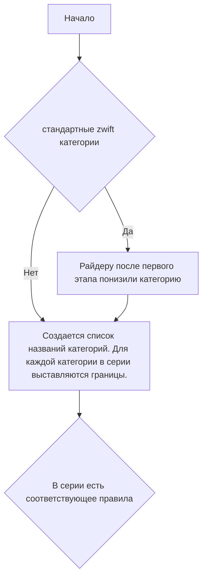

# Обработка категорий участников в сериях.

## 📋 Категория для Генеральной классификации.

1. Участник проехал все обязательные этапы серии, иначе дисквалификация;
2. Категория для ГК берется та, которая была в последнем этапе серии;
3. В серии категория от этапа к этапу:
   - не изменялась;
   - изменялась, если по правилам за это нет дисквалификации, тогда также категория берется по
     последнему этапу.

##

